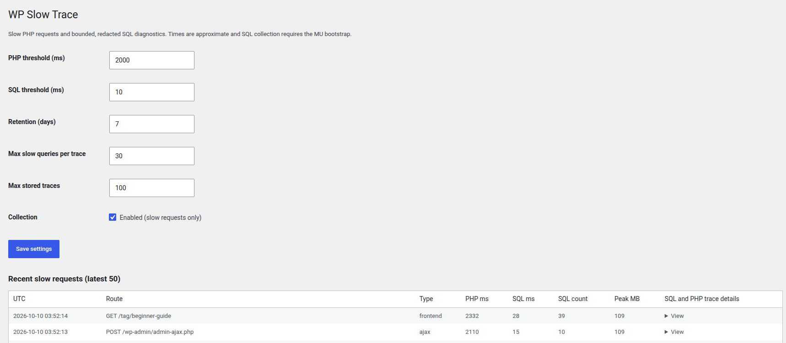

# WP Slow Trace v1.3.0

Self-contained WordPress slow-request diagnostics. No PHP-FPM configuration or WP-CLI imports required.



## Install
1. Upload the ZIP through Plugins > Add New > Upload Plugin and activate.
2. Optionally copy `mu-plugin/wp-slow-trace-bootstrap.php` to `wp-content/mu-plugins/` to collect SQL query timings. (For reliable query collection from earliest bootstrap, define `SAVEQUERIES` in wp-config.php; this incurs overhead.)
3. Visit Tools > WP Slow Trace. Defaults: PHP 2000 ms, SQL 100 ms, retention 7 days, slow requests only.

## PHP trace detail
For completed slow requests, the dashboard includes WordPress lifecycle checkpoints (hook name, elapsed time since request start, memory) alongside SQL query caller information. These checkpoints are not function-level stack traces or exclusive callback timings. Requests hung indefinitely, native extension stalls, and arbitrary function-level execution cannot be traced solely from a conventional plugin.

## Production notes
This plugin stores only paths without query strings, redacts SQL literals on a best-effort basis, and limits retained rows. SQL query callers can contain file paths. Restrict dashboard access to trusted administrators. SQL tracing uses WordPress SAVEQUERIES and adds overhead. WordPress cron cleanup runs when WordPress receives traffic. Test in staging first.

## Upgrading from v1.1
Install this version over the previous version. The old PHP-FPM traces table is not dropped automatically, to avoid deleting existing data. If you previously installed PHP-FPM settings, remove those separately; they are no longer used.

## WP-CLI commands (v1.3.0)

Run from the WordPress installation directory after activating the plugin:

```bash
wp slow-trace status
wp slow-trace report --since=24h --top=20
wp slow-trace php --since=1h --top=20
wp slow-trace sql --since=7d --top=20
wp slow-trace hooks --since=24h --top=20
wp slow-trace show 123
wp slow-trace cleanup
wp slow-trace report --since=24h --format=json
wp slow-trace sql --since=1h --format=csv
```

`--since` accepts `h` (hours), `d` (days), or `w` (weeks), up to 365 days. `--top` accepts 1–500. `--format` accepts `table`, `json`, or `csv` for list commands. `show` supports `json` (default) or `table`. `status` supports `table`, `json`, or `csv`.

Reports cover **stored, completed slow requests**, not active operating-system PHP processes. SQL reporting includes only slow SQL statements retained inside those recorded requests, and is limited by the per-request query cap. `hooks` displays elapsed WordPress lifecycle checkpoints, **not** per-hook exclusive execution time. A request may have slow SQL without being captured if its total PHP duration is below the PHP threshold. For query collection, install the optional MU bootstrap and verify `SAVEQUERIES` is enabled early enough; it adds overhead. `status` shows the SAVEQUERIES setting for the current CLI process, which may differ from web requests.

For cron-based cleanup, WP-Cron already schedules cleanup. Optionally use `wp slow-trace cleanup` in a system cron, but no system cron is required.

### Upgrading

Upload the v1.3.0 ZIP over the existing plugin. Existing stored traces and settings are preserved. Test on staging before production. No database migration is required from v1.2.0.
